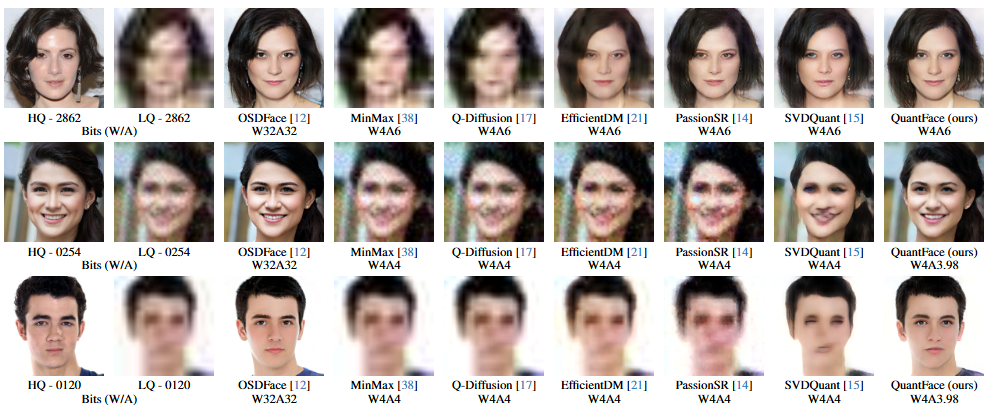

# QuantFace: Low-Bit Post-Training Quantization for One-Step Diffusion Face Restoration

[Jiatong Li](https://github.com/jiatongli2024), [Libo Zhu](https://github.com/LiBoZhu030073), [HaoTong Qin](https://htqin.github.io/), [Jingkai Wang](https://github.com/jkwang28), [Linghe Kong](https://www.cs.sjtu.edu.cn/~linghe.kong/), [Guihai Chen](https://scholar.google.com.hk/citations?user=rqZWbYgAAAAJ&hl=en), [Yulun Zhang](http://yulunzhang.com/), and [Xiaokang Yang](https://scholar.google.com/citations?user=yDEavdMAAAAJ) "QuantFace: Low-Bit Post-Training Quantization for One-Step Diffusion Face Restoration", arXiv, 2025

[arXiv] [[supplementary material](https://github.com/jiatongli2024/QuantFace/releases/download/v1/supp.pdf)] [visual results] [models]


#### 🔥🔥🔥 News

- **2025-6-1:** This repo is released.

---

> **Abstract:** Diffusion models have been achieving remarkable performance in face restoration. However, the heavy computations of diffusion models make it difficult to deploy them on devices like smartphones. In this work, we propose QuantFace, a novel low-bit quantization for one-step diffusion face restoration models, where the full-precision (\ie, 32-bit) weights and activations are quantized to 4$\sim$6-bit. We first analyze the data distribution within activations and find that they are highly variant. To preserve the original data information, we employ rotation-scaling channel balancing. Furthermore, we propose Quantization-Distillation Low-Rank Adaptation (QD-LoRA) that jointly optimizes for quantization and distillation performance. Finally, we propose an adaptive bit-width allocation strategy. We formulate such a strategy as an integer programming problem, which combines quantization error and perceptual metrics to find a satisfactory resource allocation. Extensive experiments on the synthetic and real-world datasets demonstrate the effectiveness of QuantFace under 6-bit and 4-bit. QuantFace achieves significant advantages over recent leading low-bit quantization methods for face restoration.


Pipeline of QuantFace.

## 🔖 TODO

- [ ] Complete this repository

## 🔗 Contents

- [ ] Quick Inference
- [ ] Train
- [x] [Results](#Results)
- [x] [Citation](#Citation)
- [x] [Acknowledgements](#Acknowledgements)


## <a name="results"></a>🔎 Results

We achieve impressive performance on the Synthetic Datasets and the Real-World Datasets.

<details open>
<summary>Quantitative Results (click to expand)</summary>

- Results in Tab. 1 of the main paper

<p align="center">
  
</p>


- Results in Tab. 3 of the main paper

<p align="center">
  
</p>
</details>

<details open>
<summary>Qualitative Results (click to expand)</summary>

- Results in Fig. 6 of the main paper

<p align="center">
  
</p>

- Results in Fig. 6 of the main paper

<p align="center">
  
</p>
</details>

## <a name="citation"></a>📎 Citation

If you find the code helpful in your research or work, please cite the following paper(s).

```

```

## <a name="acknowledgements"></a>💡 Acknowledgements

This project is based on [Q-Diffusion](https://github.com/Xiuyu-Li/q-diffusion), [QuaRot](https://github.com/spcl/QuaRot), [SmoothQuant](https://github.com/mit-han-lab/smoothquant), [PassionSR](https://github.com/libozhu03/PassionSR), and [Q-DiT](https://github.com/Juanerx/Q-DiT).